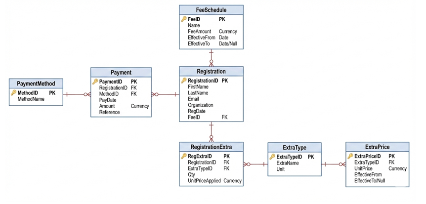

# 📅 Conference Registration System

**Conference Registration** is a professional Microsoft Access application engineered to streamline participant management for conferences and academic events. 

The system was developed with a rigorous focus on **data integrity**, **database normalization**, and **operational efficiency**, specifically designed for seamless use by event volunteers in high-pressure environments.

---

## 🛠 Technologies & Skills
* **Database:** Microsoft Access
* **Architecture:** Relational Database Design (RDBMS)
* **Language:** SQL (Complex Queries, Aggregations)
* **UI/UX:** Forms, Subforms, & Interactive Dashboards
* **Logic:** Data Validation Rules & Business Logic Separation

---

## 📐 Database Architecture & Normalization
The database architecture strictly adheres to relational design principles to ensure stability and scalability:

* **1NF (First Normal Form):** All fields contain atomic values; no repeating groups. Extras are managed via the `RegistrationExtra` relational table.
* **2NF (Second Normal Form):** Pricing logic is isolated in `ExtraPrice`, preventing redundancy and historical inconsistencies.
* **3NF (Third Normal Form):** Payments are fully dependent on `PaymentID`. Intentional persistence of applied prices is used to ensure historical financial accuracy.

### 🔒 Data Integrity Measures
- **Entity Integrity:** Strict enforcement of Primary Keys; no orphan or "ghost" records.
- **Referential Integrity:** Enforced cascading updates/deletes. Rules prevent the deletion of registrations if associated payments exist.
- **Domain Integrity:** Custom validation rules for quantities, prices, and dates to prevent invalid data entry.

---

## 🚀 Key Features

### 📊 Management Dashboard
* **Real-time Analytics:** View total cash flow and revenue per extra category.
* **Filtering:** Advanced payment filtering by date range.
* **Data Visualization:** Charts showing payment method distribution and revenue streams.

### 📝 Smart Registration Workflow
* **Centralized Control:** A main form that governs the entire participant lifecycle.
* **Dynamic Subforms:** Manage multiple extras and multiple payment installments per participant.
* **Financial Flexibility:** Supports partial payments and various payment methods with automatic balance updates.

### 💰 Financial Tracking & Reporting
* **Balance Book:** Real-time "Paid vs. Due" tracking per participant.
* **Status Indicators:**
    * 🔴 **Outstanding:** Balance due.
    * 🔵 **Settled:** Fully paid.
    * 🟢 **Credit:** Overpaid balance.
* **Inventory Insights:** Aggregated view of extras sold (quantity and total revenue).

---

## ⚙️ Configurability (Event-Agnostic)
The system is built to be reused for any event with minimal setup:
- **Dynamic Pricing:** Supports multiple phases (*Early Bird, Regular, Late*).
- **Flexible Catalog:** Easily update event dates, fees, extras/merchandising, and accepted payment methods via tables.

---

## 📈 Potential Improvements
-  Automated Invoice generation and PDF email delivery.
-  Multi-user backend support (SQL Server/Azure migration).
-  Role-based access control (Admin vs. Volunteer).

---

### 🎓 Academic Context
* **Course:** BSc in Computer Engineering
* **Institution:** Universidade Autónoma de Lisboa
* **Date:** January 2026

  *
